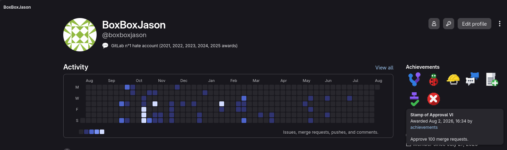

<div align="center">

# GitLab Achievements

**Turn your self-hosted GitLab into a game your team is already playing.**

[](https://github.com/BoxBoxJason/gitlab-achievements/releases)
[](https://github.com/BoxBoxJason/gitlab-achievements/pkgs/container/gitlab-achievements)
[](go.mod)
[](LICENSE)

</div>

Your instance already knows who ships code, who reviews it, and who keeps the pipelines green. This bot turns that into real [GitLab Achievements](https://docs.gitlab.com/user/profile/achievements/): **275 badges across 25 criteria**, awarded automatically, with an EXP total and an instance leaderboard on top.

Point it at a self-hosted GitLab and it takes care of itself. It creates the achievements, registers its own webhooks, walks your history once so nobody starts from zero, and from then on reacts to what people do as they do it.

It grew out of [BoxBoxJason/achievements](https://github.com/boxboxjason/achievements), a VS Code extension that gamifies local coding. Same idea, moved to the server, driven by real events instead of IDE telemetry.

> [!NOTE]
> Early days. Everything described here is implemented and covered by tests, but the project is young and GitLab's achievements API is still marked Experiment. Bug reports and [issues](https://github.com/BoxBoxJason/gitlab-achievements/issues) are very welcome.

## What people earn



| Category | Criteria |
| --- | --- |
| **Git** | commits, pushes, branches created, tags created |
| **Merge requests & review** | opened, merged, merged within the hour, approved, closed unmerged, comments left, discussions resolved |
| **Issues** | opened, closed |
| **CI/CD** | pipelines run, passed, failed, jobs run, deployments, deployments succeeded |
| **Collaboration** | emoji reactions given, wiki pages created |
| **Engagement** | days active, longest streak, night owl days, early bird days |

Every criteria stacks eleven tiers with names people actually want to collect: *Committer*, *Friend of the Trees*, *Rubber Stamp*, *Firefighter*, *Stuck the Landing*, *Night Owl*. Thresholds run from 1 to 100,000, so the first tier lands on someone's first day and the last one is a running joke.

Each tier is worth EXP, and a user's total is the sum of what they hold. Only the top tier of a criteria is pushed to GitLab, so a profile shows one *Committer* badge rather than eleven near-identical ones.

## Quick start

You need a self-hosted GitLab 16.6 or later, a group to hold the achievement definitions, two access tokens and a URL your instance can reach. [GitLab-side setup](docs/gitlab-setup.md) covers all of it and takes about ten minutes.

Then, on any host with Docker Compose:

```bash
git clone https://github.com/BoxBoxJason/gitlab-achievements.git
cd gitlab-achievements
cp .env.example .env
$EDITOR .env
docker compose up -d
```

The first start creates 275 achievements and registers webhooks before it serves anything, so give it a minute (longer on Free/CE, where every project gets its own hook). Once `/readyz` answers, you are live:

```bash
curl -sf http://127.0.0.1:8080/readyz && echo ready
```

Awards start going out as people work, and history gets walked in the background so past activity counts too. One thing to warn your team about: GitLab keeps an award hidden until its recipient accepts it from the email it sends, and [nobody but the recipient can do that](docs/achievements-api-behavior.md).

## The EXP API

GitLab has no notion of points, so this app is the only place that number exists. It is served read-only, straight from its own database.

| Method | Path | Returns |
| --- | --- | --- |
| `GET` | `/api/v1/users/{ref}` | EXP total, criteria counters, and every tier earned |
| `GET` | `/api/v1/users/{ref}/exp` | Just the number |
| `GET` | `/api/v1/leaderboard?limit=N` | Top N users by EXP |

```console
$ curl -s https://achievements.example.com/api/v1/users/alice/exp
{"username":"alice","gitlab_user_id":42,"exp_total":1350}
```

`{ref}` is a username or a numeric user ID. Open to anyone by default; set `API_AUTH=gitlab` and callers have to present a GitLab token, or sign in through the browser at `/oauth/login`. Full details in [the API reference](docs/api.md).

## Deploy it

One static binary plus a SQL database (PostgreSQL, SQLite, MySQL/MariaDB or SQL Server). No agent on your GitLab, no plugin, no patched instance.

| Target | What you get | Guide |
| --- | --- | --- |
| **Kubernetes** | Helm chart with probes, ingress, secrets and an optional backfill Job | [docs/deployment/kubernetes.md](docs/deployment/kubernetes.md) |
| **Docker Compose** | The app and a PostgreSQL on one host, from one file | [docs/deployment/docker-compose.md](docs/deployment/docker-compose.md) |
| **Bare binary** | A systemd unit against a database you already run | [docs/deployment/bare-binary.md](docs/deployment/bare-binary.md) |

Run one copy of it. It owns your instance's webhooks and its own background sweeps, so a second replica just does everything twice.

## Documentation

Everything lives in [docs/](docs/).

| | |
| --- | --- |
| [GitLab-side setup](docs/gitlab-setup.md) | The group, the two tokens, the webhook secret. Start here |
| [Configuration](docs/configuration.md) | Every flag and environment variable |
| [How it works](docs/how-it-works.md) | The lifecycle, from bootstrap to steady state |
| [Achievements & EXP](docs/achievements.md) | The catalog, the tiers, and what reaches GitLab |
| [The API](docs/api.md) | Endpoints, responses, authentication |
| [Webhooks](docs/webhooks.md) | Which hooks get registered, and why |
| [Historical backfill](docs/backfill.md) | Awarding for activity that predates the bot |
| [Reconciliation](docs/reconciliation.md) | Catching what the webhooks dropped |
| [Uninstalling](docs/uninstall.md) | Taking it back off your instance |

## Contributing

Bug reports, criteria ideas and pull requests are all welcome. [CONTRIBUTING.md](CONTRIBUTING.md) has the setup.

```bash
make build      # binary into ./bin
make test       # unit tests
make lint       # golangci-lint
make package    # container image
make helm/lint  # lint and render the Helm chart
```

## License

[MIT](LICENSE)
